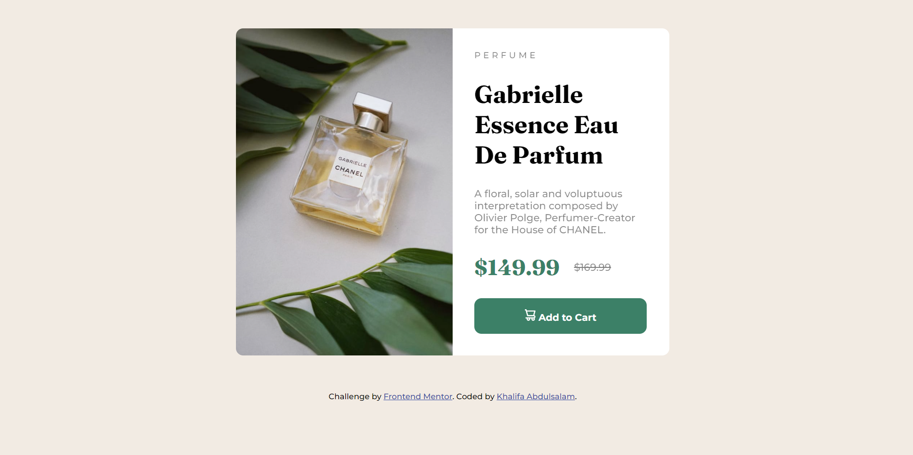

# Frontend Mentor - Product preview card component solution

This is a solution to the [Product preview card component challenge on Frontend Mentor](https://www.frontendmentor.io/challenges/product-preview-card-component-GO7UmttRfa).  

## Table of contents

- [Overview](#overview)
  - [The challenge](#the-challenge)
  - [Screenshot](#screenshot)
  - [Links](#links)
- [My process](#my-process)
  - [Built with](#built-with)
  - [What I learned](#what-i-learned)
  - [Continued development](#continued-development)
  - [Useful resources](#useful-resources)
- [Author](#author)
- [Acknowledgments](#acknowledgments)


## Overview

### The challenge

Users should be able to:

- the optiml layout of this design was made to suit the desktop layout and not yet responsive for mobile versions. 
-The call-to-action button was designed as an interactive element potraying certain colour trab=nsition and transformation in its hover and focus states.

### Screenshot




### Links

- Solution URL: 
- Live Site URL: (https://khalifaomeiza.github.io/product-preview-card-component-main/)

## My process

### Built with

- Semantic HTML5 markup
- CSS custom properties
- Flexbox
- CSS Grid


### What I learned

Use this section to recap over some of your major learnings while working through this project. Writing these out and providing code samples of areas you want to highlight is a great way to reinforce your own knowledge.

To see how you can add code snippets, see below:


```css
.proud-of-this-css {
    display: grid;
    grid-template-columns: 1fr 1fr;
    overflow:hidden;
    display: flex;
    flex-direction: column;
}

```


### Continued development

The areas i would want to focus on in future projects would be in making the design responsive and in ensuring effective time management in coding designs.


### Useful resources

- [Google fonts](https://fonts.google.com/) - This helped me in setting my font style.


## Author

- Frontend Mentor - [@khalifaomeiza](https://www.frontendmentor.io/profile/khalifaomeiza)
- Twitter - [@khalifaomeiza](https://www.twitter.com/khalifaomeiza)


## Acknowledgments

My hat tip goes to my instructor at Loctech Training Institute, Mr. Promise Udo. He was my inspiration and i owe my successes to him. Then again, to my family, to my brother Fahad and my dearest Fatima, Thank you.


